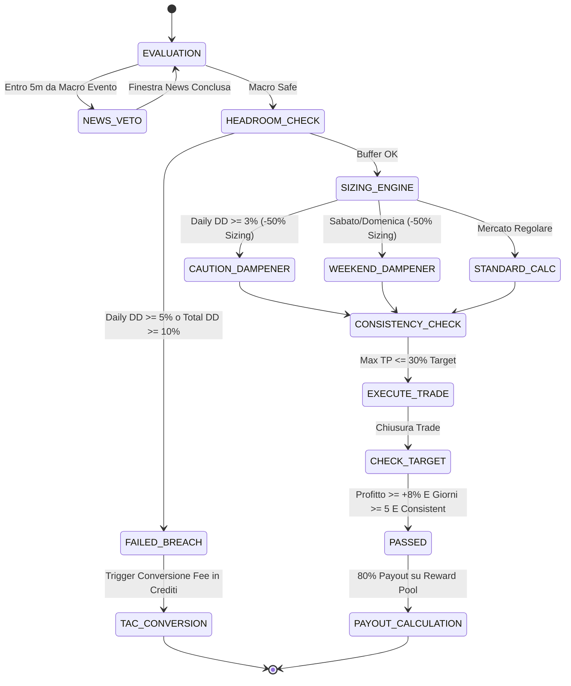

# TRADEAID CHALLENGE RISK AGENT — ALGORITMO & SPECIFICA MATEMATICA V1.0
**Algoritmo di Position Sizing Istituzionale e Stop Loss Dinamico per Prop Challenges**  
**Versione:** 1.0.0  
**Target Tiers:** STARTER ($10k), PRO ($50k), ELITE ($100k), BLACK ($150k)  
**Vincoli:** Max Daily DD 5.00% · Max Total DD 10.00% · Target +8% · Consistency Cap 30%  

---

## 1. Obiettivo Matematico & Filosofia di Rischio

Il **Challenge Risk Agent** ha un unico mandato categorico: **massimizzare la probabilità di raggiungere il target del +8% senza violare il Daily Drawdown (5.00%) né il Total Drawdown (10.00%)**, mitigando rigorosamente il rischio di serie avverse di trade consecutivi in perdita (*consecutive loss streak*), gap di mercato e slippage.

### Assiomi Fondamentali:
1. **Zero-Ruin Daily Constraint**: Il budget di rischio intraday è partizionato in "slot" di perdita indipendenti. Nessun singolo trade può assorbire più di $\frac{1}{3}$ della capacità di perdita giornaliera residua.
2. **Volatilità Normalizzata via ATR (Average True Range)**: La distanza dello Stop Loss non è mai fissa in percentuale o dollari arbitrari, ma è funzione della volatilità reale di mercato ($ATR_{14}$ a 15m/1h) maggiorata di una soglia minima di rumore.
3. **Consistency Rule Safeguard**: Nessun trade può realizzare un Take Profit superiore al $30\%$ dell'obiettivo di profitto complessivo ($+8\%$), prevenendo la squalifica per "gambling spike".

---

## 2. Formulazione Matematica delle Variabili

### 2.1 Parametri di Ingresso
* $C_{nom}$: Capitale Nominale del Tier ($10,000$, $50,000$, $100,000$, $150,000$ USDT).
* $C_{bal}$: Saldo attuale dell'account (Equity Mark-to-Market).
* $C_{SOD}$: Saldo a inizio giornata (*Start of Day Balance* registrato a mezzanotte UTC).
* $HWM$: Picco massimo storico (*High-Water Mark*) dell'account.
* $P_{entry}$: Prezzo stimato di ingresso dell'asset (es. BTC a $60,000 USDT).
* $ATR_{14}$: Average True Range a 14 periodi sul timeframe operativo.
* $r_{target}$: Rischio target standard per trade (default: $0.75\%$ del balance).
* $DD_{daily\_max}$: Limite massimo Daily DD ($5.00\%$).
* $DD_{total\_max}$: Limite massimo Total DD ($10.00\%$).

---

## 3. Algoritmo di Calcolo in 8 Fasi

### Fase 1: Filtri di Esclusione Macro (Veto Check)
Prima di qualsiasi calcolo quantitativo:
1. **News Blackout Window**: Se l'orario attuale $t$ cade entro $\pm 5$ minuti da un evento macro ad alto impatto (US CPI, FOMC Rate Decision, Non-Farm Payrolls):
   $$\text{Decisione} = \text{VETO} \quad (Q = 0)$$
2. **Account Breach Invalidation**: Se $C_{bal} \le C_{SOD} \times (1 - 0.05)$ oppure $C_{bal} \le HWM \times (1 - 0.10)$:
   $$\text{Decisione} = \text{FAILED} \quad (\text{Trigger Auto-Conversione Fee in Crediti TAC})$$

---

### Fase 2: Calcolo dell'Headroom di Drawdown Giornaliero
La capacità di perdita massima consentita per la giornata corrente è:
$$L_{daily\_limit} = C_{SOD} \times \frac{DD_{daily\_max}}{100} = C_{SOD} \times 0.05$$

La perdita già registrata o flottante nella giornata è:
$$L_{today} = \max(0, \, C_{SOD} - C_{bal})$$

Il **Budget di Rischio Giornaliero Residuo** ($B_{daily}$) è:
$$B_{daily} = \max(0, \, L_{daily\_limit} - L_{today})$$

Se $B_{daily} \le 0$, l'accesso al trading è immediatamente revocato per la giornata corrente.

---

### Fase 3: Allocazione del Rischio per Singolo Trade ($R_{trade}$)
Per garantire la sopravvivenza a un minimo di **3 stop-loss consecutivi nello stesso giorno**, il rischio allocato in dollari è vincolato al minimo tra il rischio standard e un terzo del buffer residuo:

$$R_{std} = C_{bal} \times \frac{r_{target}}{100} = C_{bal} \times 0.0075$$

$$R_{buffer} = \frac{B_{daily}}{3.0}$$

$$R_{trade} = \min(R_{std}, \, R_{buffer})$$

#### Moltiplicatori di Condizione & Smorzatori:
1. **Weekend Dampener**: Nei fine settimana (Sabato e Domenica UTC), a causa della minore liquidità e del rischio di gap:
   $$M_{wknd} = 0.50 \implies R_{trade} = R_{trade} \times 0.50$$
2. **Caution Yellow-Zone**: Se il Daily Drawdown corrente supera il $3.00\%$ (ovvero oltre il $60\%$ della capienza massima consentita):
   $$M_{caution} = 0.50 \implies R_{trade} = R_{trade} \times 0.50$$

---

### Fase 4: Stop Loss Dinamico Basato su Volatilità
La distanza dello Stop Loss ($D_{SL}$) in dollari USDT tiene conto sia dell'ATR che di un pavimento minimo anti-rumore ($0.8\%$):

$$D_{SL} = \max\Big(k_{ATR} \times ATR_{14}, \, 0.008 \times P_{entry}\Big)$$
*(con $k_{ATR} = 1.8$ standard)*

I livelli di prezzo sono:
* **Per posizioni LONG**:
  $$P_{SL} = P_{entry} - D_{SL}$$
* **Per posizioni SHORT**:
  $$P_{SL} = P_{entry} + D_{SL}$$

---

### Fase 5: Take Profit Dinamico con Risk/Reward $\ge 2.0$
Il Take Profit viene posizionato per soddisfare un Risk/Reward minimo di $1:2$:
$$D_{TP} = D_{SL} \times 2.0$$

* **Per posizioni LONG**: $P_{TP} = P_{entry} + D_{TP}$
* **Per posizioni SHORT**: $P_{TP} = P_{entry} - D_{TP}$

---

### Fase 6: Dimensionamento della Posizione ($Q$)
La quantità di asset da acquistare/vendere viene derivata rigorosamente dal rischio monetario prefissato:

$$Q = \frac{R_{trade}}{D_{SL}}$$

Il **Controvalore Nominale della Posizione** ($V_{pos}$) è:
$$V_{pos} = Q \times P_{entry}$$

La **Leva Effettiva** ($L_{eff}$) è:
$$L_{eff} = \frac{V_{pos}}{C_{bal}}$$

Se $L_{eff} > L_{max}$ ($L_{max} = 10x$), la posizione viene ridimensionata:
$$V_{pos} = C_{bal} \times L_{max} \implies Q = \frac{C_{bal} \times L_{max}}{P_{entry}}$$
$$R_{trade} = Q \times D_{SL}$$

---

### Fase 7: Protezione Regola di Coerenza (Consistency Rule Cap)
Per superare la challenge, nessun singolo giorno o trade può realizzare oltre il $30\%$ del profitto obiettivo.
L'obiettivo di profitto totale è:
$$Profit_{target} = C_{nom} \times 0.08$$
Il profitto massimo consentito per singolo trade è:
$$TP_{max} = Profit_{target} \times 0.30 = C_{nom} \times 0.024$$

Se il potenziale guadagno al Take Profit ($Q \times D_{TP}$) supera $TP_{max}$:
$$ScaleDown = \frac{TP_{max}}{Q \times D_{TP}}$$
$$Q = Q \times ScaleDown$$

Questo assicura in modo deterministico che il trader non rischi l'annullamento della prova per eccesso di concentrazione dei profitti in un solo colpo fortunato.

---

## 4. Esempi Operativi per i 4 Tiers

### Caso Studio 1: Tier PRO ($50,000 USDT) — Condizioni Normali
* **Capitale Iniziale**: $50,000.00
* **Saldo di Inizio Giornata ($C_{SOD}$)**: $50,000.00
* **Max Daily DD Consentito (5%)**: $2,500.00
* **Asset**: Bitcoin (BTC) a $P_{entry} = \$60,000.00$, $ATR_{14} = \$600.00$
* **Calcolo**:
  1. $B_{daily} = \$2,500.00$
  2. $R_{std} = \$50,000 \times 0.0075 = \$375.00$
  3. $R_{buffer} = \frac{\$2,500}{3} = \$833.33 \implies R_{trade} = \$375.00$
  4. $D_{SL} = \max(1.8 \times 600, \, 0.008 \times 60,000) = \max(1,080, \, 480) = \$1,080.00$
  5. $P_{SL} = \$60,000 - \$1,080 = \$58,920.00$
  6. $P_{TP} = \$60,000 + (2 \times \$1,080) = \$62,160.00$
  7. $Q = \frac{\$375.00}{\$1,080.00} = \mathbf{0.34722222 \text{ BTC}}$
  8. $V_{pos} = 0.34722222 \times 60,000 = \$20,833.33 \implies \mathbf{Leva \approx 0.42x}$ (Estremamente conservativa e protetta).

---

### Caso Studio 2: Tier PRO ($50,000 USDT) — Drawdown Caution Zone (Loss $2,000)
* **Saldo Attuale**: $48,000.00 (Perdita giornaliera: -$2,000 = -4.00% DD)
* **Limite**: -5.00% ($2,500) $\implies$ **Buffer Residuo**: $\$500.00$
* **Applicazione Regola Yellow-Zone (>3.0% DD)**:
  1. $R_{buffer} = \frac{\$500.00}{3} = \$166.67$
  2. Applicazione smorzatore caution ($50\%$): $R_{trade} = \$166.67 \times 0.50 = \mathbf{\$83.33}$
  3. $Q = \frac{\$83.33}{\$1,080.00} = \mathbf{0.07716049 \text{ BTC}}$
  4. $V_{pos} = \$4,629.63 \implies \mathbf{Leva \approx 0.10x}$
* **Esito**: Anche se il trade dovesse colpire lo Stop Loss, la perdita massima sarebbe di soli $\$83.33$, lasciando ancora oltre $\$416.00$ di margine e **impedendo la liquidazione o il fallimento della challenge**.

---

### Caso Studio 3: Tabella Sinottica Comparativa dei 4 Tiers

| Parametro | STARTER ($10K) | PRO ($50K) | ELITE ($100K) | BLACK ($150K) |
| :--- | :--- | :--- | :--- | :--- |
| **Capitale Virtuale** | $10,000.00 | $50,000.00 | $100,000.00 | $150,000.00 |
| **Target Phase 1 (+8%)** | $800.00 | $4,000.00 | $8,000.00 | $12,000.00 |
| **Max Daily DD (-5%)** | $500.00 | $2,500.00 | $5,000.00 | $7,500.00 |
| **Max Total DD (-10%)** | $1,000.00 | $5,000.00 | $10,000.00 | $15,000.00 |
| **Rischio Base/Trade (0.75%)** | **$75.00** | **$375.00** | **$750.00** | **$1,125.00** |
| **Max TP Singolo (Cap 30%)** | $240.00 | $1,200.00 | $2,400.00 | $3,600.00 |
| **Consecutive Losses Buffer** | $\ge 6$ trades | $\ge 6$ trades | $\ge 6$ trades | $\ge 6$ trades |
| **Fee Convertibile in TAC** | 50 TAC | 100 TAC | 500 TAC | 1,500 TAC |

---

## 5. Stato Macchina del Challenge Risk Agent

---

## 6. Verifiche & Test Suite Automatizzata

L'algoritmo è implementato in `src/risk/challenge_risk_agent.py` e verificato da suite PyTest dedicata (`tests/test_challenge_risk_agent.py`):
- `test_challenge_risk_agent_rules_and_consistency`: Verifica il cap del 30% sui profitti giornalieri.
- `test_challenge_risk_agent_drawdown_breach_and_tac_credits`: Verifica la transizione a `FAILED` e la concessione dei crediti TAC al 100% della fee versata.
- `test_challenge_risk_agent_pass_and_80_percent_payout`: Verifica il calcolo dell'80% di payout reale al completamento conforme.
- `test_news_filter_and_weekend_sizing`: Verifica l'inibizione del trading durante US CPI e il dimezzamento della taglia nel weekend.
- `test_position_sizing_algorithm_50k_pro`: Verifica il calcolo matematico della quantità, stop loss, take profit e leverage sia in condizioni normali che in Yellow-Zone (-4% DD).
